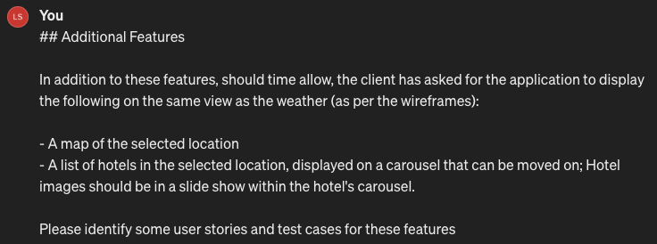
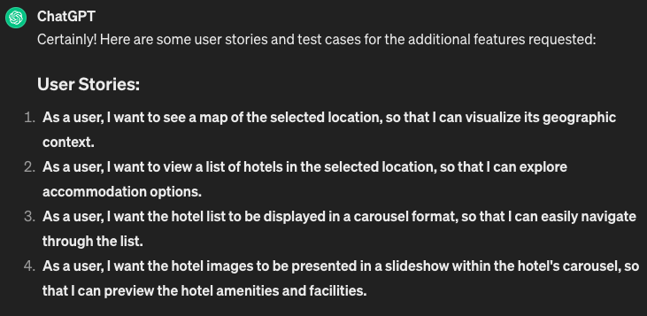
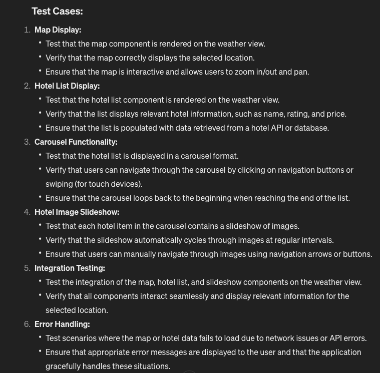
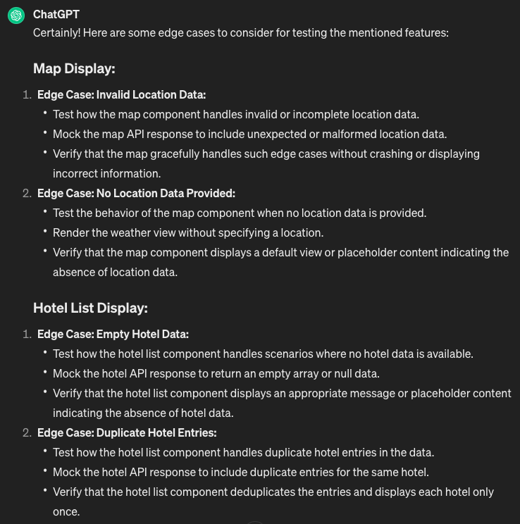
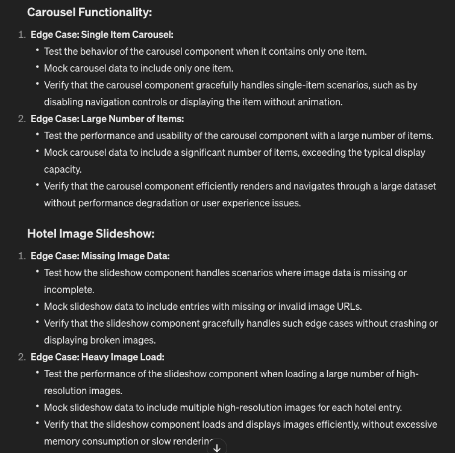
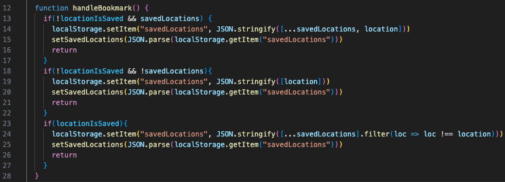
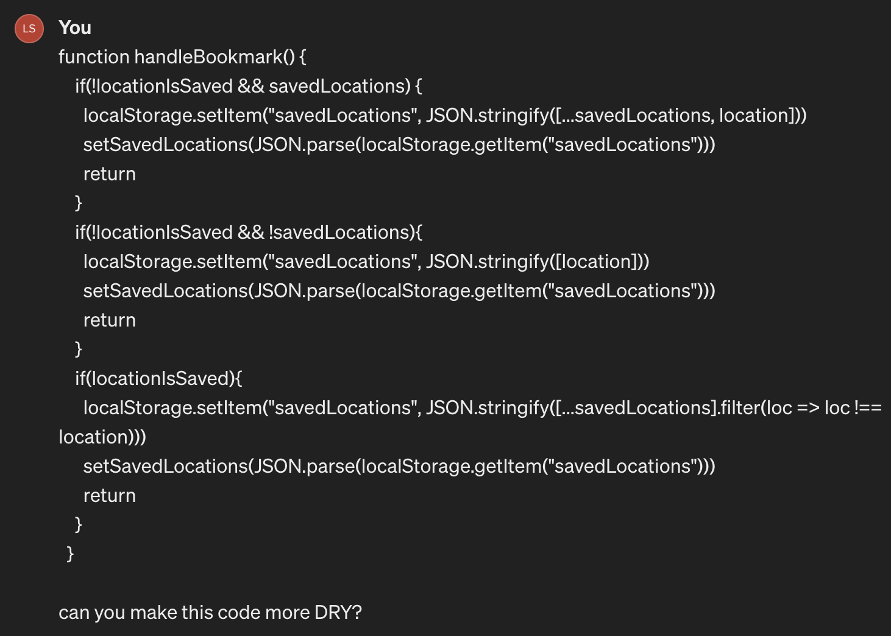
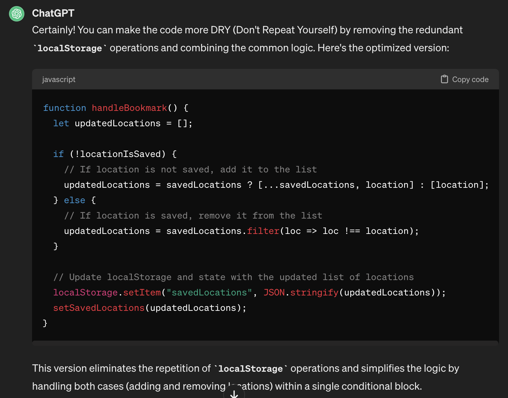

# Use of Generative AI

## Generative AI for Additional Features

### I asked ChatGPT to come up with some user stories and test plans for me:

### I then asked ChatGPT to identify some edge cases for these:

## Generative AI for Refactoring

### I asked ChatGPT to refactor this piece of code to make it more efficient and cleaner:

