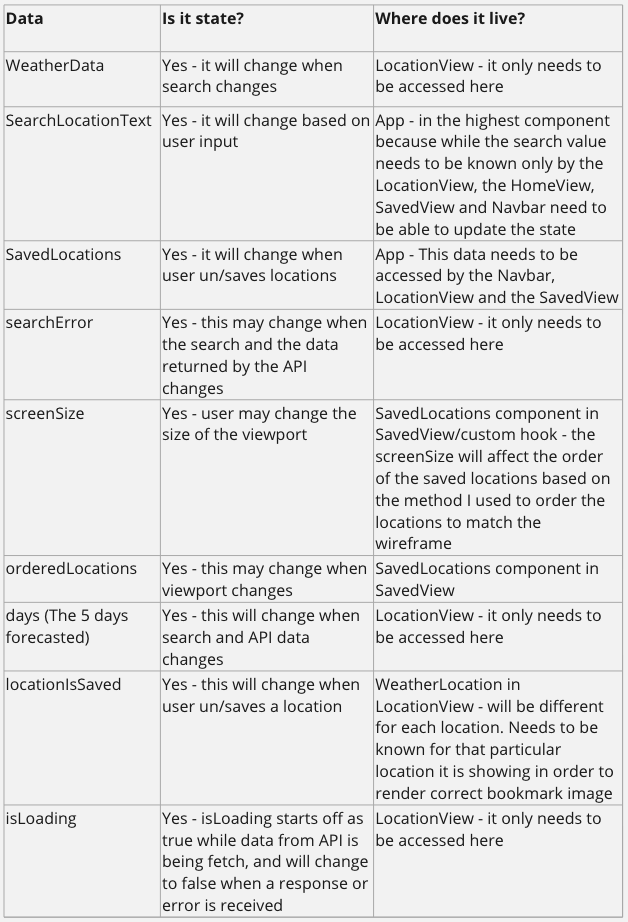

# User Stories, Test Plans and Component Hierarchy

## User Stories and Test Plans

### Core Features

1. **As a user, I want to be able to access a web-based travel information application, so I can get information about a location**
2. **As a user, I want to be able to see a location search box on the home page, so I know where to search for a location**

- TEST : App component should have search box

3. **As a user, I want to be able to search by any town or city name, so that I can get information about that place**

- TEST: When user types and searches a location in HomeView, site navigates to LocationView
- TEST: When user types and searches nothing, site does not navigate away from HomeView
- TEST: When user types and searches whitespace, site does not navigate away from HomeView
- TEST: getLocationWeatherUtil returns weather data for location searched

4. **As a user, I want my query to return a 5 day forcast of the location from a weather API, so that I can see the latest weather for the week**

- TEST: extractWeatherData returns data in correct format

5. **As a user, I want to see a new view displayed when forecast data is returned, so that I can see the information**

- TEST: When data for location is returned, LocationView should display components
- TEST: When data for location is returned, WeatherLocation should show correct location
- TEST: When data for location is returned, WeatherToday should show correct information
- TEST: When data for location is returned, WeatherDaily should show correct information
- TEST: Error when location doesn't exist or is invalid

6. **As a user, I want to be able to save a location as a favourite, so that I can quickly see certain locations**

- TEST: Saving a location saves to local storage
- TEST: Saving a location displays in the UI
- TEST: Unsaving a location remove from local storage
- TEST: Unsaving a location displays in the UI

7. **As a user, I want to application to be responsive across the main breakpoints for devices, so I can easily use it on any device**

8. **As a user, I want the navbar to only display "My Saved Locations" if I have any saved locations, so that I know when I do or do not have saved locations**

- TEST: My Saved Locations should not be displayed in navbar when no locations are saved
- TEST: My Saved Locations should display in navbar when locations are saved

9. **As a user, I want the navbar to show search bar if I'm not on the home page, so that I can focus on one area**

- TEST: Navbar search bar should not be displayed when in HomeView
- TEST: Navbar search bar should be displayed when not in HomeView

### Additonal Features (GEN AI)

10. **As a user, I want to see a map of the selected location, so that I can visualize its geographic context**

- TEST: Test that the map component is rendered on the weather view
- TEST: Map API/service to return specific location data
- TEST: Verify that the map correctly displays the selected location
- TEST: Mock the map API response to include unexpected location data or errors

11. **As a user, I want to view a list of hotels in the selected location, so that I can explore accommodation options**

- TEST: Test that the hotel list component is rendered on the weather view
- TEST: Verify that the list displays correct hotel information, such as name, location and rating
- TEST: Mock the hotel API response to return an empty array or null data

12. **As a user, I want the hotel list to be displayed in a carousel format, so that I can easily navigate through the list**

- TEST: Test that the hotel list is displayed in a carousel format
- TEST: Test the behavior of the carousel component when it contains only one item

13. **As a user, I want the hotel images to be presented in a slideshow within the hotel's carousel, so that I can preview the hotel amenities and facilities**

- TEST: Test that each hotel item in the carousel contains a slideshow of images
- TEST: Mock carousel data to include a limited number of items and test navigation beyond the last item

## Component Hierachy, State/Data Flow Diagrams

